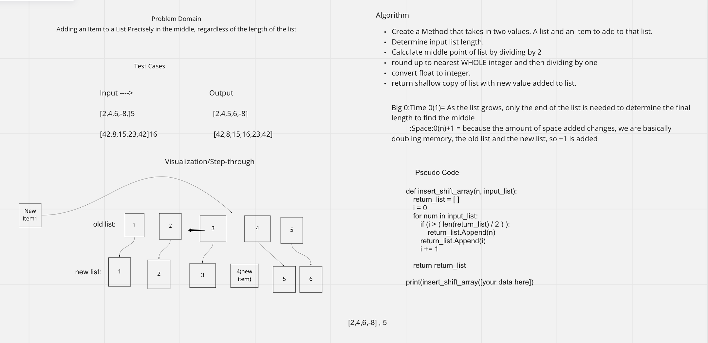

# Insert to Middle of an Array

The goal of this script is to insert a given variable in the direct middle of a given array without using any relevant inbuilt methods in python.

## Whiteboard Process

## Approach & Efficiency

Instead of using the given methods in python we have to be creative, so we construct a new array and fill it using the old array, until it reaches the midwaypoint, at which time it also adds the new variable, and then continues as normal. Because of this our Big O for both time and space is O(n) because it expands linearly with the size of the data.
