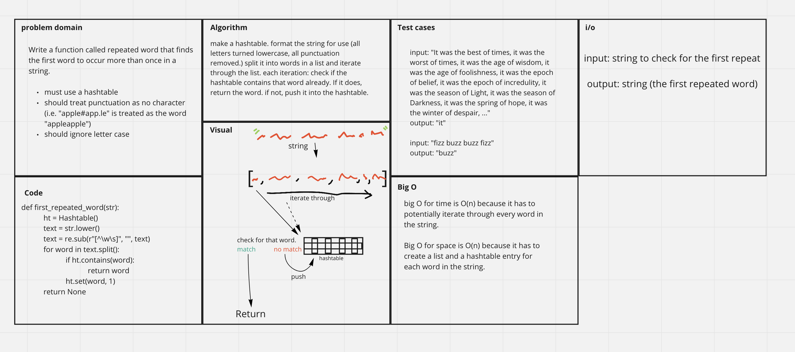

# Challenge Summary
Using a hashtable, write a function that takes in a string and returns the first word which is repeated in that string. Stretch goal: using a hashtable, write a function that returns a list of all word counts for a string.

## Whiteboard Process

## Approach & Efficiency
The string is cleaned up and then split into words. The words are then pushed into a hashtable. When there is a collision, each function acts differently. In the case of `first_repeated_word()`, when this happens the function ends and returns the colliding word. In `word_count()` the function instead increments the value of the stored entry, and then continues on, until the entire string has been pushed into the hashtable. Then it pulls out the whole hashtable and pushes it into a dictionary, for ease of access, then returns that dict.

* `first_repeated_word()`
  * time
    * O(n) because it potentially has to iterate through every word in the string
  * space
    * O(n) because it has to create a list item and a hashtable entry for each word in the string. They don't have references to them after the function ends though.
* `word_count()`
  * time
    * O(n) because it definitely has to iterate through every word in the string
  * space
    * O(n) because it has to create a list item and a hashtable entry for each word in the string, as well as a dictionary containing every word. only the dictionary sticks around though.

## Solution

* first_repeated_word()
  * args:
    * str: the string to test
  * returns:
    * str with the first repeated word.
  * example:
    * command: `first_repeated_word('It was the night before Christmas, and all through the house, not a creature was stirring, not even a mouse.')`
    * output: `'the'`
* word_count()
  * args:
    * str: the string to test
  * returns:
    * dictionary of all words in the string and their number of occurences, organized by frequency.
  * example:
    * command: `word_count('It was the best of times, it was the worst of times, it was the age of wisdom, it was the age of foolishness, it was the epoch of belief, it was the epoch of incredulity, it was the season of Light, it was the season of Darkness, it was the spring of hope, it was the winter of despair, ...')`
    * output: `{'it': 10, 'the': 10, 'was': 10, 'of': 10, 'times': 2, 'season': 2, 'age': 2, 'epoch': 2, 'worst': 1, 'belief': 1, 'hope': 1, 'darkness': 1, 'incredulity': 1, 'light': 1, 'spring': 1, 'wisdom': 1, 'best': 1, 'winter': 1, 'despair': 1, 'foolishness': 1}`

## Thanks

Thanks to these pages for helping with this project: [geeksforgeeks](https://www.geeksforgeeks.org/python-remove-punctuation-from-string/), [stackoverflow](https://stackoverflow.com/questions/72899/how-do-i-sort-a-list-of-dictionaries-by-a-value-of-the-dictionary).
