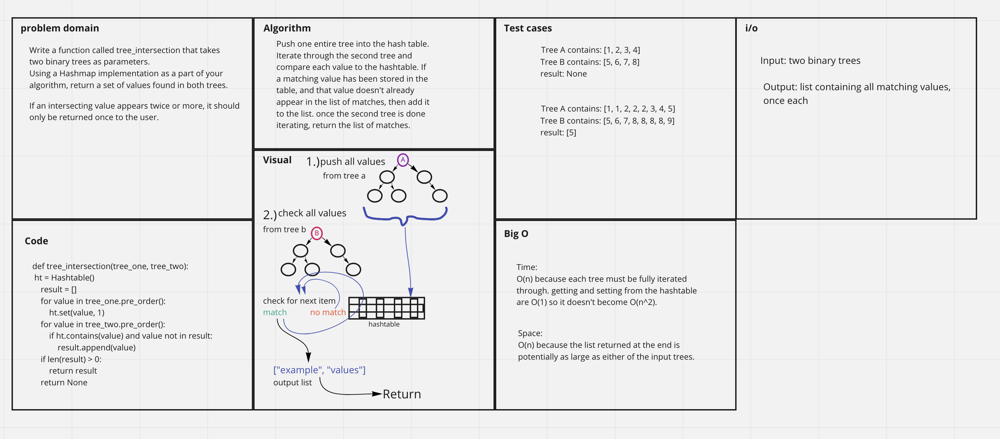

# Challenge Summary

Write a function called tree_intersection that takes two binary trees as parameters.
Using a Hashmap implementation as a part of your algorithm, return a set of values found in both trees.

## Whiteboard Process

## Approach & Efficiency

The first tree is iterated through and added to the hashtable piece by piece. The second tree is iterated through and compared to the contents of the hashtable. If any values match, that value is added to the return list.

Efficiency:

* Time:
  * O(n) because each full tree must be iterated through so it expands linearly. This would be O(n^2) if it was a linkedlist for instance, but because it's a hashtable, the `.contains(value)` calls are O(1) not O(n).
* Space:
  * O(n) because a new list must be created that is potentially as large as one of the input lists.

## Solution
Methods:
* `tree_intersection(tree_one, tree_two):`
  * args:
    * `tree_one` and `tree_two` are the two trees to be compared.
  * returns:
    * a list with all intersecting values. duplicate intersecting values are not shown.

Example:
* `t1` contains: `[100, 100, 123, 456, 789]`
* `t2` contains: `[100, 100, 100, 456, "789"]`
* command:
  * `tree_intersection(t1, t2)`
* returns:
  * `[100, 456]`

