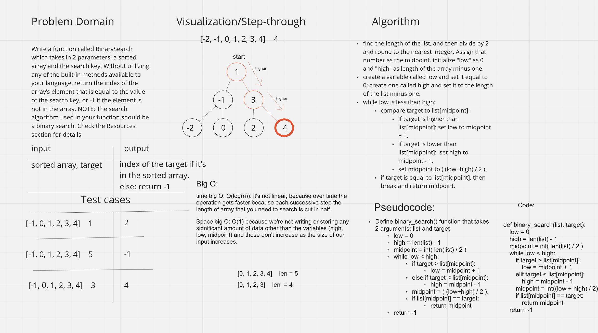

# Binary Search of Sorted Array

This is a script that given a sorted list and a target value, will return the index of that target value if it exists in the list, or returns -1 if the target does not appear in the list.

## Whiteboard Process

## Approach & Efficiency

We split the search space in half, check if the current value is higher or lower than the target value, eliminate the corresponding half, and repeat that, until the result is narrowed down and the value is found.
The time big O: O(log(n)). it's not linear, because over time the operation gets faster because each successive step the length of array that you need to search is cut in half.
Space big O: O(1) because we're not writing or storing any significant amount of data other than the variables (high, low, midpoint) and those don't increase as the size of our input increases.
