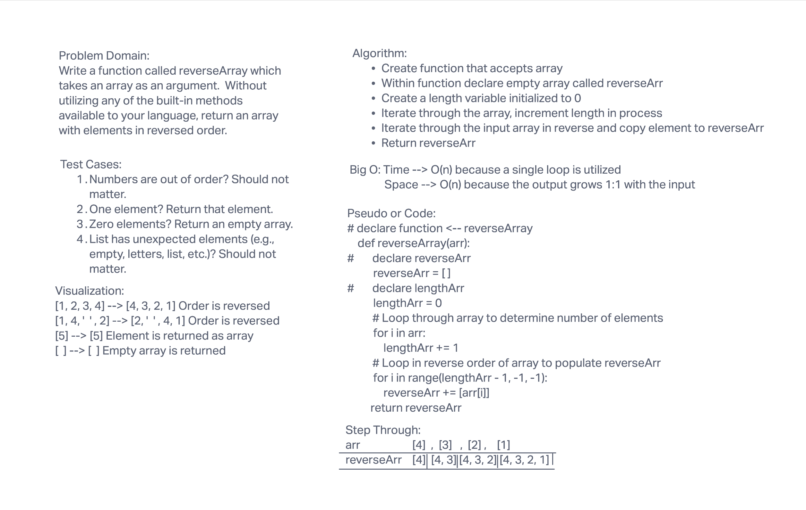

# Reverse an Array

This algorithm is designed to reverse an input list by making a new output list and populating it iteratively by running backwards through the input list.

## Whiteboard

## Approach & Efficiency

This algorithm is O(n) complexity for both time and space; the number of steps and the size of the output are both linearly correlated with the size of the input list. This probably isn't the absolutely most efficient way to handle the problem; for instance, if we were using a way to reverse the list in place, the space would be O(1) because we wouldn't be creating any new variables or list items. We also didn't have to use a for loop to calculate the length of the list but we did because we weren't sure if the prepackaged method was allowed or not. That could be replaced by just taking the length attribute from the list.

I did this challenge with Marni and JJ.
