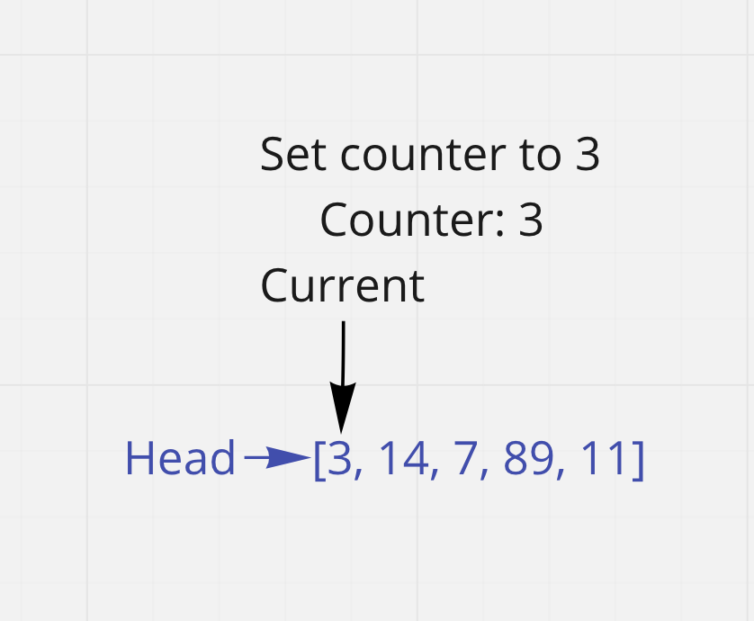
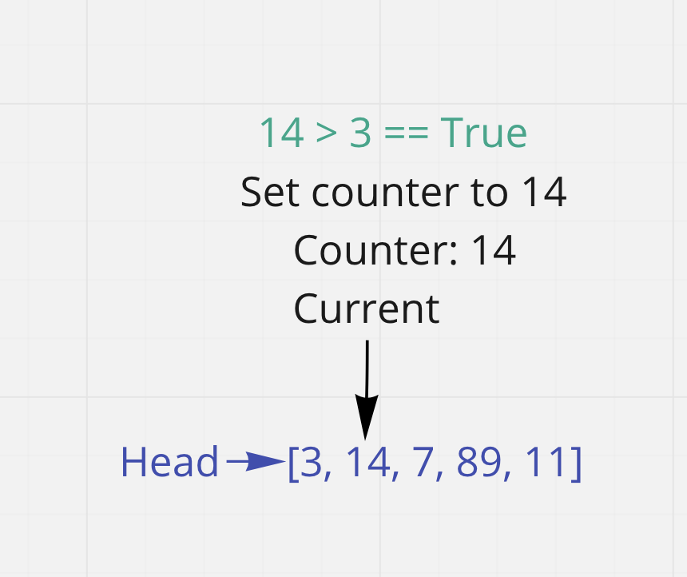
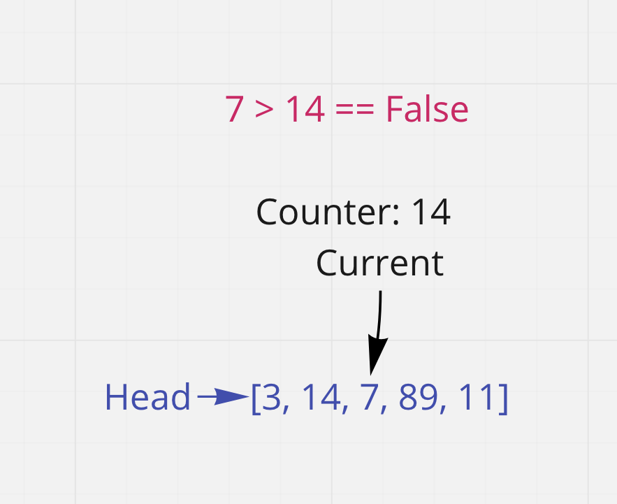
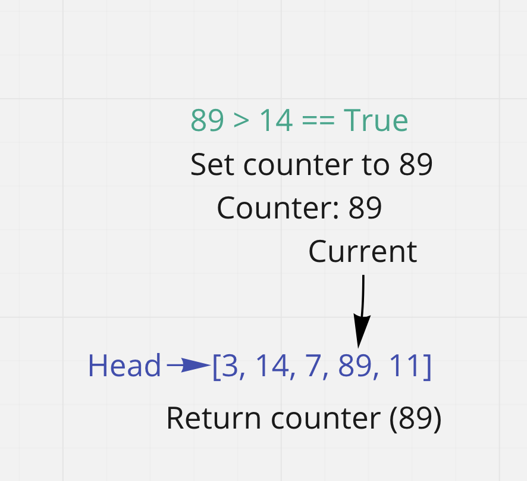
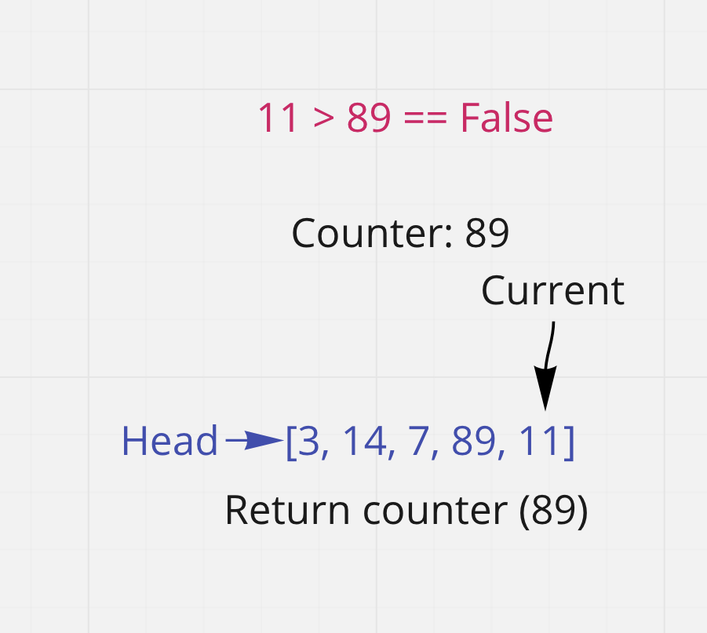
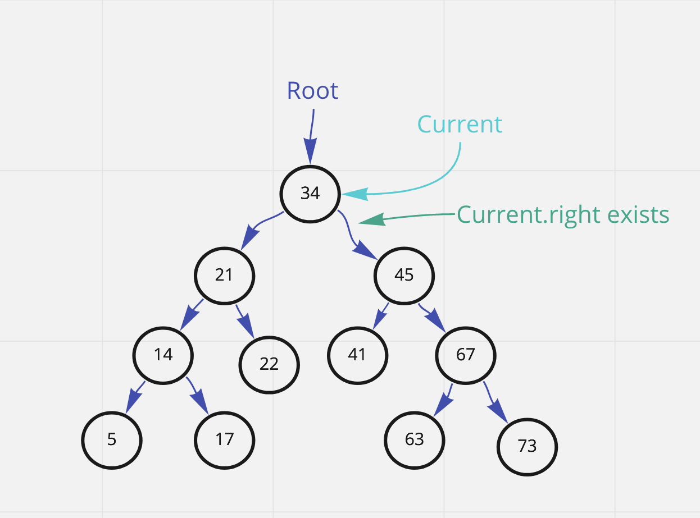
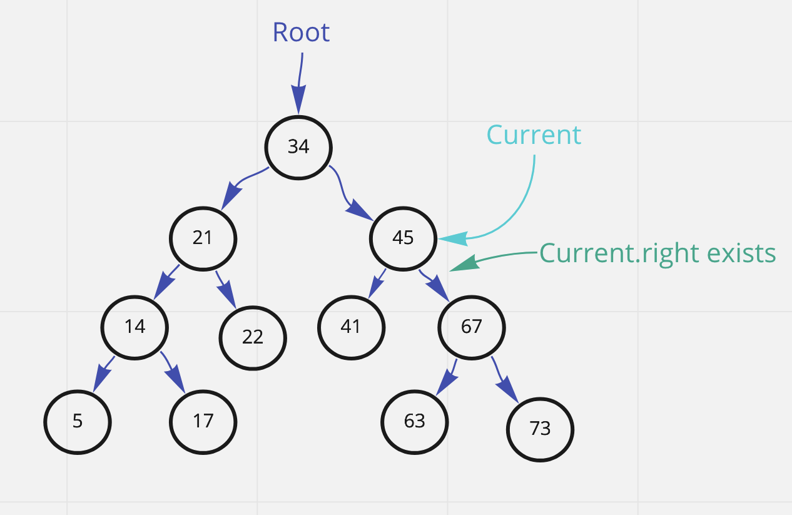
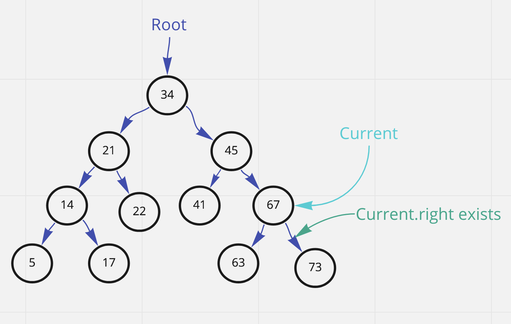
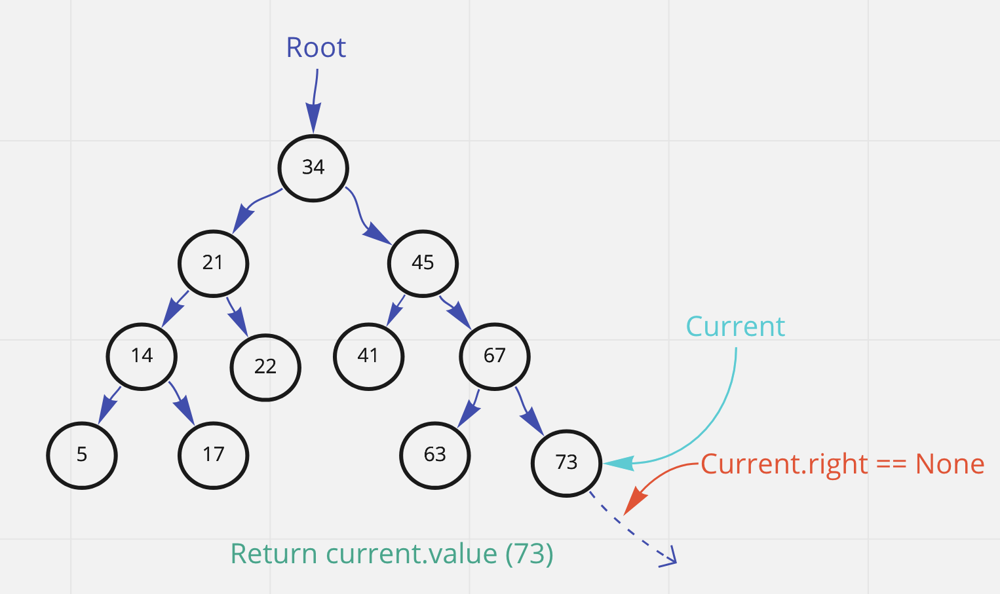

# Linked list and BST: finding the largest value

## Linked List

### Code

```
class LinkedList:
    def __init__(self, head=None):
        # initialization here
        self.head = head

class Node:
    def __init__(self, value, next=None):
        self.value = value
        self.next = next

def find_largest(linked_list):
    current = linkedlist.head
    counter = current.value
    while current:
        if current.value > counter:
            counter = current.value
        current = current.next
    return counter
```

### Trace

Sample list: [3, 14, 7, 89, 11]

#### Step 1:


current and counter are initialized to the head node and its value respectively.

#### Step 2:

Traverse the list by going to current.next. The new node is 14, so the greater than comparison with the previous node, 3, returns True. The counter is set to 14 and the process continues.

#### Step 3:

Continue the traversal. The new node is smaller than before, so the counter remains at 14.

#### Step 4:

This time the new node is larger again, and so the counter is set to 89.

#### Step 5:

The last comparison returns false so 89 is the largest number in the set. The while loop stops going because current.next becomes `None`. Then finally the counter is returned, and so we get the highest value in the list.

### Efficency:

#### Time:
The time efficency is O(n) because all nodes must be traversed exactly once, meaning `n` actions.

#### Space:
The space efficency is O(1) because no new data structures are being created.


## Binary Search Tree

### Code

```
class BinaryTree:
    """
    Put docstring here
    """

    def __init__(self, root=None):
        self.root = root
        self.counter = None
        pass

class Node:
    def __init__(self, value, left=None, right=None):
        # initialization here
        self.value = value
        self.left = left
        self.right = right

def find_largest(bst):
    current = bst.root
    while current.right:
        current = current.right
    return current.value
```

### Trace

Because of the way a binary search tree is organized, we can traverse the right-most path of the tree until it ends to find the highest value. We can be sure it's the right value because any higher value added to the list would have ended up to the right of it, but the final node has no right node.





### Efficency:

#### Time:
The time efficency is O(h) because the maximum possible number of traversals is the height of the tree. Depending on how the tree is organized, `h` can go up to `n` but will normally be much lower for most binary search trees.

#### Space:
The space efficency is O(1) because no new data structures are being created.
