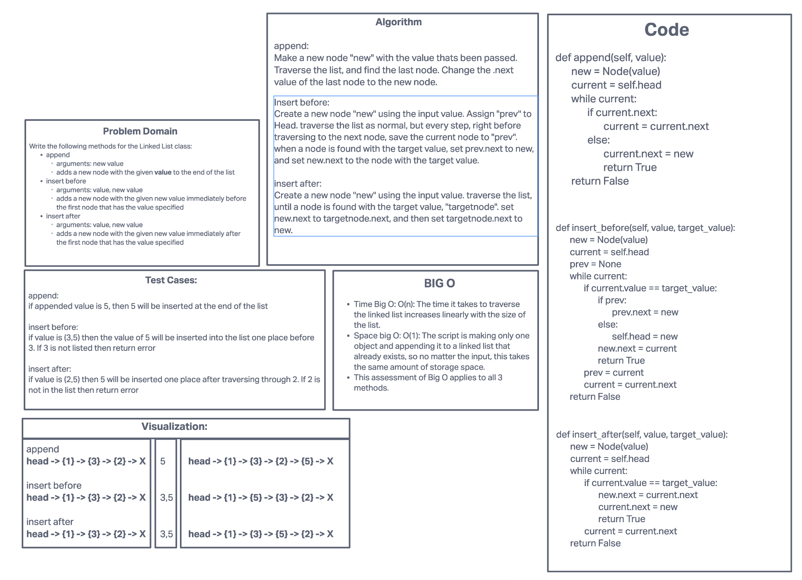

# Singly Linked List

This is a simple implementation of a singly linked list in python. It functions a lot like a list but the memory it takes up is non-contiguous, so it's better for certain applications, like large data storage (because it won't have to read/write the entire list if the length is substantially increased and it no longer fits in its current space in memory; the new nodes will just be placed wherever is free in memory, so the original list can stay in place).

## Challenge

Write a system of linked lists which can be manually constructed with node objects, can insert new nodes, can check to see if the entire list includes a given value or not, and can output the entire list as a formatted string.

## Approach & Efficiency

For this list as a whole:
* Big O space is O(n) because the space the list takes up is linearly proportional with the number of nodes in the list.

`insert` method:
* Big O time for this approach is O(1) because only 2 objects are being manipulated, no matter the size of the list: The head value of the linked list, the new node object that's being inserted. Everything else remains the same.
* Space big O: O(1): The script is making only one object and attaching it to a linked list that already exists, so no matter the input, this takes the same amount of storage space.

`append`, `insert_before`, and `insert_after` methods:
* Time Big O: O(n): The time it takes to traverse the linked list increases linearly with the size of the list.
* Space big O: O(1): The script is making only one object and appending it to a linked list that already exists, so no matter the input, this takes the same amount of storage space.

## API

Available Classes and methods:

* LinkedList
  * Props:
    * `head`
      * Stores a reference to first node in the list
  * Methods:
    * `insert(value)`:
      * inserts a new node with `value` as its value at the head of the list. Returns true on success.
    * `append(value)`:
      * Inserts a new node with `value` as its value at the bottom of the list. Returns true on success, false on failure.
    * `insert_before(value, target_value)`:
      * Inserts a new node with `value` as its value directly before the first instance of `target_value` that appears in the list.
    * `insert_after(value, target_value)`:
      * Inserts a new node with `value` as its value directly after the first instance of `target_value` that appears in the list.
    * `includes(value)`
      * returns a boolean based on if `value` appears anywhere in the list (`True` if it *is* included)
    * `to_string()` or `str([name of the list])`
      * returns the entire linked list as a string formatted like this: `"{ node1.value } -> { node2.value } -> { node3.value } -> NULL"`
* Node
  * Props:
    * `value`
      * Stores any value
    * `next`
      * Stores a reference to the next node in the list. `None` by default. Nodes at the end of lists have their `.next` equal to `None`, by definition.

## Whiteboard

