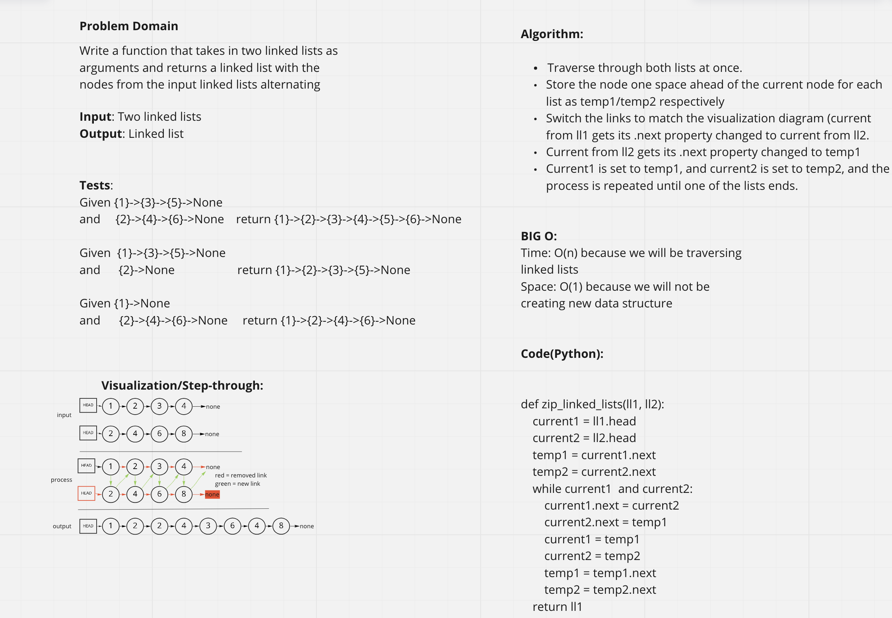

# Challenge Summary
Given two linked lists, "zip" them together, so that the output linked list goes { ll1 node 1 } {ll2 node 1} {ll1 node 2} {ll2 node 2} etc..

## Whiteboard Process

## Approach & Efficiency
We iterate through the two lists simultaneously, using temporary variables to store 1 set of upcoming nodes. The current nodes are changed to link between the two lists in the right pattern, and then the temporary nodes are used to reset and repeat the process (which would otherwise be impossible because the links to them in the current nodes are lost upon linking them to each other).
The time big O for this solution is O(n) because this process will take a (linearly) increasing amount of time per node in the input lists. The space big O for this is O(1) because we aren't making any new data structures, just modifying one in place.

## Solution
The function takes in 2 linked lists and outputs a single linkedlist. We had to set up special handling for cases where, for instance, one list is much shorter or longer than the other, or one (or both) lists are empty. This is achieved with a series of ifs and elifs, but this can probably be refactored to be more efficient (or at the very least, nicer looking).

