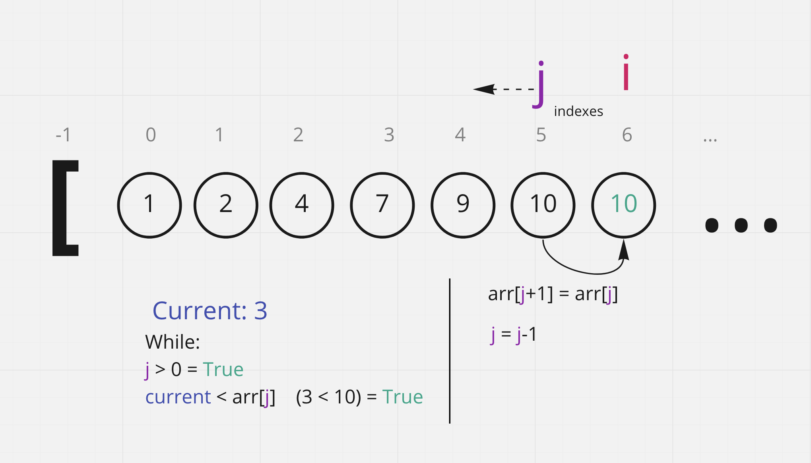

# Insertion Sort

Insertion sort is a sorting algorithm which iterates through a list and at each value compares it to the list of previous values and slots it into place correctly in that list.

## Pseudocode:

```
InsertionSort(int[] arr)

    FOR i = 1 to arr.length

        int j <-- i - 1
        int current <-- arr[i]

        WHILE j >= 0 AND current < arr[j]
            arr[j + 1] <-- arr[j]
            j <-- j - 1

        arr[j + 1] <-- current
```

## Trace:

Because of the high number of steps, it makes more sense to show single iterations of the process in detail than try to trace the process for the entire array, because that part is self-explanatory once each iteration makes sense. The first iteration will be shown, and then the fifth iteration will be shown.

Sample array: 
`[7, 4, 2, 1, 9, 10, 3, 5, 8, 6]`

## First Iteration:

### Pass 1:

The variables `i` and `j` are initialized to 1 and 0 respectively. The variable `current` is initialized to the value of `i`'s index in the array, which is 4. The conditions in the while loop are satisfied (0 is greater than or equal to 0 and 4 is less than 7), and so it will start iterating.

The array at index (`j`+1) is replaced with the value from `j`'s index. `j` is set to `j`-1, so it becomes -1.

The conditions for the while loop are no longer met because `j` < 0. The array at `j`+1, which is index 0, is changed to `current`.
The loop is completed. Now `i` will iterate up to 2, `j` will be set to `i`-1 again, `current` will be set to `arr[i]`'s new value which is 2, and the whole process will start again.
Our first two numbers are now sorted correctly!

However, the first few steps of the for loop iterating don't really show what's going on. To better illustrate how the algorithm works, we're going to jump ahead to the fifth step.

## Fifth iteration:

The algorithm is on its 5th iteration. The numbers that the algorithm has already passed are sorted amongst themselves. `i` has just been iterated to 6, and `j` is now set to 5.
`current` is set to `arr[i]` which is 3.

### Pass 1:

The array at index `j`+1 (`arr[6]`) is replaced with the value from `arr[j]` which is 10. `j` is is incremented down to 4. The conditions for the while loop are still true, as `j` is greater than 0 and `arr[j]` (which is 10) is greater than `current` (which is 3), so the loop continues.

### Pass 2:

In the same process as before, `arr[5]` is replaced with the contents of `arr[4]`, and `j` decrements to 3. The conditions are still met, so the while loop continues.

### Pass 3:

Again, the conditions are met and the while loop continues.

### Pass 4:

However, once this step of the while loop goes through, the conditions are no longer met. `j` has been decremented to 1, and `arr[1]` is 2, so `arr[j]` is no longer greater than `current`.


The while loop has ended, so now we perform `arr[j + 1] <-- current`. `arr[2]` is set to 3 (from `current`).

All the items up to index `i` have now been sorted, so another cycle of the enclosing for loop will start; `i` will be set to 7, `j` will be set to 6, and the whole process will start over again.

After each step of iteration through the for loop, the entire list up until that point will be sorted. It's kind of like a binary search tree; you take a simple repeatable process that always puts a variable in the right position, and you just walk through the whole dataset step by step and perform that process on each item. Once you've walked through the whole array, it's organized!


## Efficiency:
* time: O(n^2):
  * each position in the array must be iterated through, which is O(n); at each of these positions, an O(n) search through the previous array must also be performed. The two O(n) efficiencies are multiplied together, resulting in O(n^2)
* space: O(1):
  * No new data structures are being created; the array is modified in place.


## Link to code:
[Insertion Sort](insertion_sort.py)
