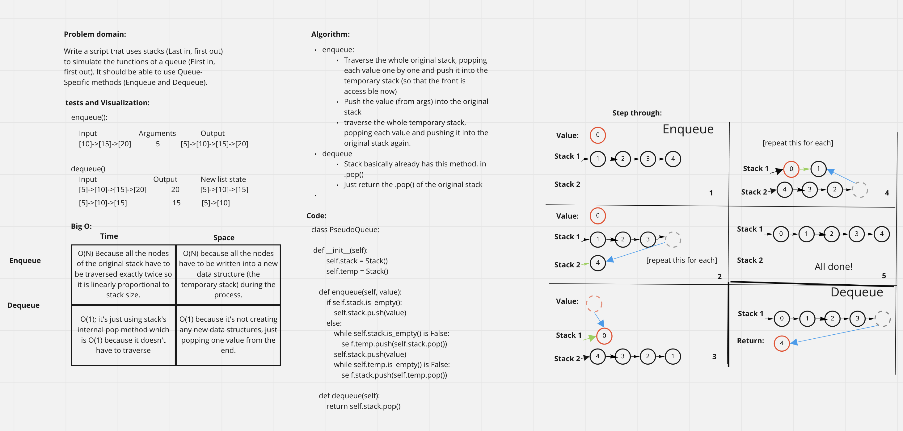

# PseudoQueue
Write a challenge that uses a stack (Last in, first out) to simulate the functions of a queue (First in, first out)

## Whiteboard

## Approach & Efficiency
I used a second stack to temporarily store the values for the queue so we can add values at the top. This has both time and space complexity of O(n) because it takes linearly proportional amount of time and space to traverse and store the stack in another stack. The dequeue method is simple because it the same as stack.pop() which only has time and space of O(1) because it isn't creating any new data structures or traversing through any existing ones.

## Solution
You can use this code by doing pesudoqueue.enqueue(value) to add a value at the front of the queue, which doesn't return anything, or pseudoqueue.dequeue() which returns the value which has been dequeued.
