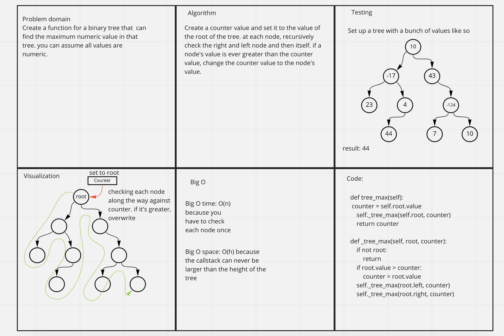

# Challenge Summary
Create a function for a binary tree that  can find the maximum numeric value in that tree. you can assume all values are numeric.

## Whiteboard Process

## Approach & Efficiency
Create a counter value and set it to the value of the root of the tree. at each node, recursively check the right and left node and then itself. if a node's value is ever greater than the counter value, change the counter value to the node's value. Big O time: O(n) because you have to check each node once. Big O space: O(h) because the callstack can never be larger than the height of the tree.

## Solution
find_max_value(): returns the max value in the tree, as long as the tree contains only numeric values. Takes no arguments.

